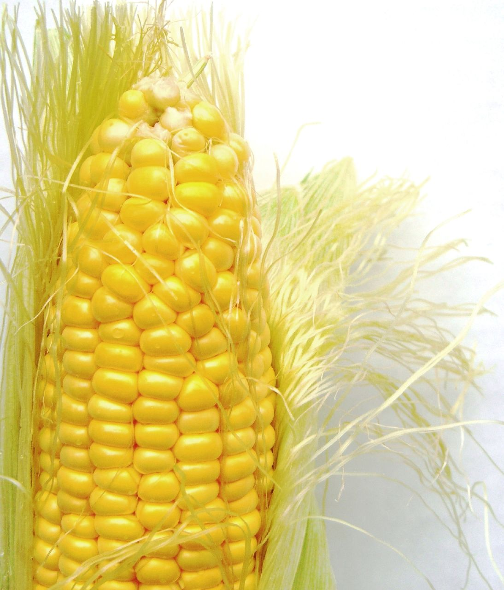

# SAS-Grain-Prices
Final project for BIOS 7400 with Xiao Song at the University of Georgia (USA), Spring 2022. Simple analysis in SAS v9.4 of grain price trends.

*Image is sourced from [Wikimedia](https://commons.wikimedia.org/wiki/File:Corn_on_the_cob.jpg).*

## File Structure
- **code**: contains SAS code files used for cleaning and analyzing data.
- **data**: contains all data used for this analysis.
  - **SAS**: contains cleaned `.sas7bdat` dataset files.
  - **raw**: contains raw text and Excel data downloaded from the internet.
- **figs**: contains all images which will be displayed in either READMEs or the final paper.
- **manuscript**: contains `.tex` and associated files which constitute the final paper.

## Objectives

The goals for this project are as follows.
- [ ] Introduce the datasets and provide brief background on research questions of interest (write the introduction section).
- [x] Import the datasets and transform into the correct rectangular form for merging, if necessary. Name and label all variables.
- [x] Merge the datasets by year.
- [x] Manipulate, transform, and clean the merged dataset as necessary for analysis.
- [ ] Justify the data management process (write the methods section).
- [ ] Analyze the cleaned data to produce analytical results.
- [ ] Produce figures and tables that are clear and meaningful.
- [ ] Summarize the results of the analysis (write the results section).
- [ ] Briefly interpret the results and connect to the research questions (write the discussion section).
- [ ] Ensure all SAS code is documented and maintainable.

## Data sources

This project uses three separate data sources.

1. **USDA feed grains database**: can be accessed [on the USDA website](https://www.ers.usda.gov/data-products/feed-grains-database/). I downloaded all data from the database, which you can replicate using this [direct download link](https://www.ers.usda.gov/webdocs/DataFiles/50048/Feed%20Grains%20Yearbook%20Tables-All%20Years.xls?v=4138.8).
2. **NASA land-ocean temperature index data**: can be accessed on [NASA's GISTEMP website](https://data.giss.nasa.gov/gistemp/). The direct download link is [here](https://data.giss.nasa.gov/gistemp/tabledata_v4/NH.Ts+dSST.txt).
3. **US presidential party by year dataset**: downloaded from [an article in The Guardian](https://www.theguardian.com/news/datablog/2012/oct/15/us-presidents-listed#data).

## Language

Data cleaning and analysis will be performed using SAS v9.4. I do not own a SAS license, so I will be using [SAS on Demand for Academics](https://www.sas.com/en_us/software/on-demand-for-academics.html). 

## Licenses

**Text and figures**: All prose and images are licensed under the [Creative Commons Attribution-ShareAlike 4.0 International (CC BY-SA 4.0) license](https://creativecommons.org/licenses/by-sa/4.0/).

**Code**: All code is licensed under the [GNU Affero General Public License v3.0](/LICENSE).

## Acknowledgements

* The assignment instructions for this project were created by [Xiao Song](https://publichealth.uga.edu/faculty-member/xiao-song/) at the University of Georgia.
* I first worked on the USDA feed grains database for [a project](https://github.com/wzbillings/Corn-Price-Analysis) for [John Wagaman](https://www.wcu.edu/faculty/jcwagaman.aspx)'s MATH 375 class at Western Carolina University. This project would not have been possible without several hours of his time in 2019. Indeed, I likely would not be in grad school for data analysis without John's advice.
* Technically, the [University of Georgia Graduate School](https://grad.uga.edu) paid me to do this work, as they provide my funding.
